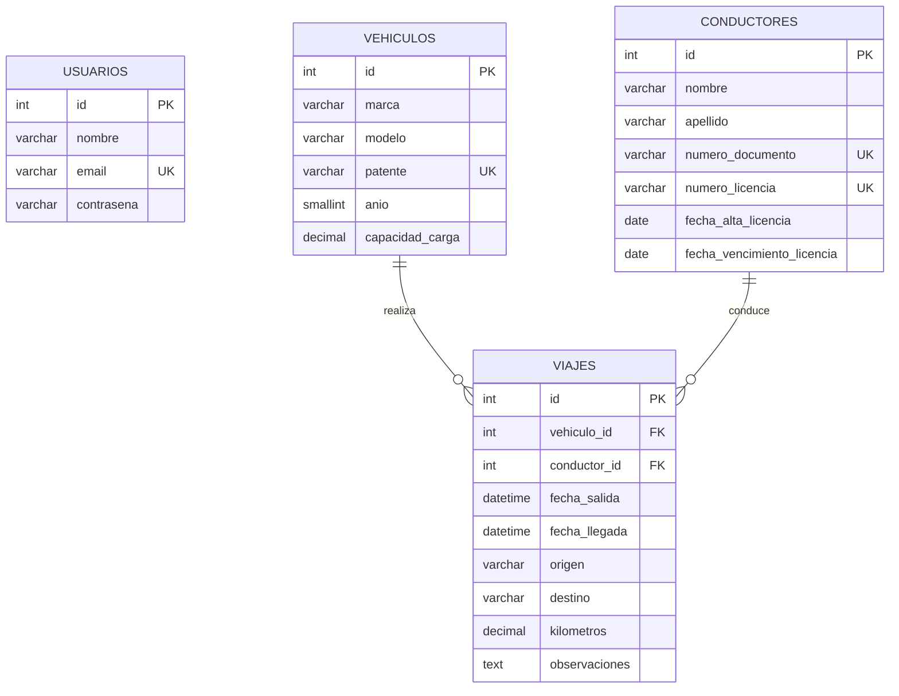

```mermaid
erDiagram
    USUARIOS {
        int id PK
        varchar nombre
        varchar email UK
        varchar contrasena
    }
    VEHICULOS {
        int id PK
        varchar marca
        varchar modelo
        varchar patente UK
        smallint anio
        decimal capacidad_carga
    }
    CONDUCTORES {
        int id PK
        varchar nombre
        varchar apellido
        varchar numero_documento UK
        varchar numero_licencia UK
        date fecha_alta_licencia
        date fecha_vencimiento_licencia
    }
    VIAJES {
        int id PK
        int vehiculo_id FK
        int conductor_id FK
        datetime fecha_salida
        datetime fecha_llegada
        varchar origen
        varchar destino
        decimal kilometros
        text observaciones
    }
    VEHICULOS ||--o{ VIAJES : realiza
    CONDUCTORES ||--o{ VIAJES : conduce
```